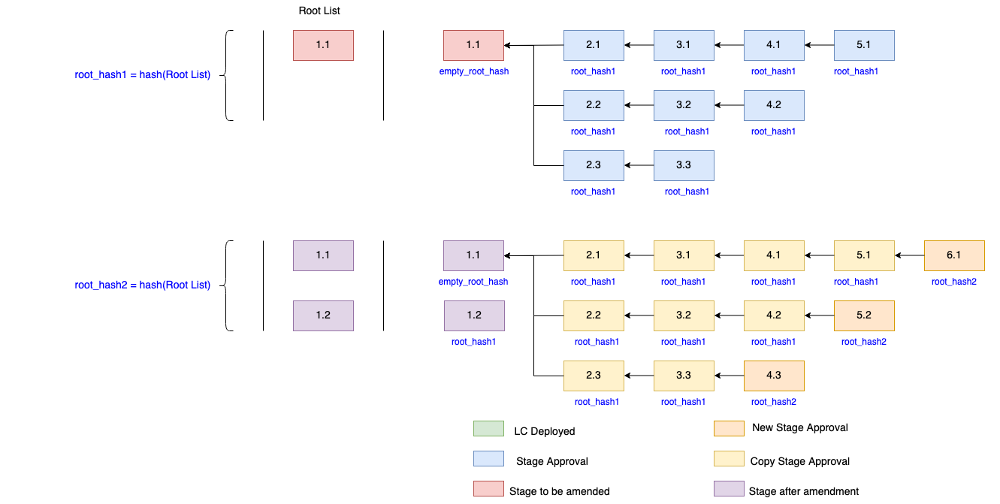

# Tu Chỉnh LC Contract - Amendment

  

Đối với blockchain thì vấn đề thay đổi nội dung trong một block sau khi được lưu on-chain là điều hoàn toàn không thể xảy ra. Ở design hiện tại những approval data cho các stages khác nhau khi đưa thông tin lên smart contract sẽ được liên kết với cách thức tương tự như các block liên kết với nhau. Tuy nhiên đối với smart contract, việc tu chỉnh (amendment) vẫn có thể thực hiện được với một số điều kiện ràng buộc. Trong phần này sẽ đề cấp đến những quy tắc trong việc tu chỉnh để có thể đảm bảo được những tính năng sau:
- Validity
- Integrity
- Fairness
- Transparency

#### Tu chỉnh sẽ deploy một LC Contract mới
Trong blockchain, những transactions bị failed đều được lưu lại nhằm đảm bảo tính transparency. Do đó, khi có việc tu chỉnh xảy ra thì việc đó cũng tương tự như một failed transaction và yêu cầu một LC Contract mới sẽ được deploy lại. Việc deploy lại một contract mới sẽ không bắt buộc các bên liên quan phải đưa lên on-chain lại từ đầu tất cả các stages. Mà thay vào đó sẽ cho phép được migrate những confirmed cũ sang LC Contract mới. Tuy nhiên, việc này sẽ có những quy tắc và sẽ được đề cập trong các phần tới

  

- Sẽ có 2 loại tu chỉnh:
  - Tu chỉnh trên các sub-stages
    - Đó là các Stage như 2.1, 2.2, 3.1, 3.2, .....
  - Tu chỉnh trên root của LC (Stage 1.1)

Note:
- Khi hợp đồng giữa Applicant và Beneficiary thay đổi
  - LC Contracts cần phải deploy lại
  - Các Stages cần phải được approve lại từ đầu vì trong trường hợp này `documentID` đã hoàn toàn là một thông tin mới

#### Tu chỉnh trên các sub-stages
- Cho phép tu chỉnh ở các sub-stages mới nhất của nhánh đó

  

Trình tự sẽ được thực hiện như sau:
> Hash của các stages (1.1, 2.1, 3.1....) sẽ được migrate sau khi tu chỉnh sẽ group lại với nhau và được các bên liên quan trong LC ký để tạo signature (confirm step)
> Stage 4.2 thuộc về NHPH, thì việc yêu cầu tu chỉnh sẽ được thực hiện bởi NHPH. NHPH gửi yêu cầu tu chỉnh và đưa các thông tin được yêu cầu (hash của migrating stages, confirmed signatures, và thông tin mới của Stage 4.2) lên contract
> Contract sẽ tiến hành verify các thông tin. Sau đó, một contract mới sẽ được deploy, tiến hành migrate, khoá contract cũ (set deprecated flag), và lưu lại thông tin mới của Stage 4.2 -> kết thúc việc tu chỉnh

- Cho phép tu chỉnh ở các sub-stages bất kỳ ở một nhánh với điều kiện là sau khi tu chỉnh thì nhánh sẽ có latest stage

  

Tương tự như việc tu chỉnh ở trên, trong các tu chỉnh này thì Stage được tu chỉnh sẽ trở thành latest stage của nhánh đó (discard những stages phía sau). Có thể hiểu một cách đơn giản là roll-back stages đến thời điểm tất cả các bên đồng ý, rồi sau đó thêm vào stage được tu chỉnh
> Hash của các stages (1.1, 2.1, 2.2, 3.2, ....) sẽ được migrate sau khi tu chỉnh sẽ group lại với nhau và được các bên liên quan trong LC ký để tạo signature (confirm step)
> Stage 3.1 thuộc về NHĐT, thì việc yêu cầu tu chỉnh sẽ được thực hiện bởi NHĐT. NHĐT gửi yêu cầu tu chỉnh và đưa các thông tin được yêu cầu (hash của migrating stages, confirmed signatures, và thông tin mới của Stage 3.1) lên contract
> Contract sẽ tiến hành verify các thông tin. Sau đó, một contract mới sẽ được deploy, tiến hành migrate, khoá contract cũ (set deprecated flag), và lưu lại thông tin mới của Stage 3.1 -> kết thúc việc tu chỉnh

#### Tu chỉnh trên root (Stage 1.1)
- Hình thức tu chỉnh này sẽ không cho phép trực tiếp thay đổi nội dung của Stage 1.1. Thay vào đó, Stage 1.2 sẽ được cung cấp thêm và cần có một số điều kiện:
  - Contract mới sẽ phải được deploy (transarency, integrity)
  - Cung cấp đầy đủ thông tin và chữ ký như một stages bình thường
  - Cung cấp các stages sẽ được migrate (array của các hash)
  - Chữ ký confirm của tất cả các bên có liên quan

- Việc làm này sẽ thay đổi root hash của LC. Do đó, đề xuất thêm `root_hash` vào trong cấu trúc của stage khi các bên liên quan tham gia approve. Cụ thể, là chữ ký xác nhận của mỗi stage sẽ có thêm `root_hash` tại thời điểm ký. Thế nào là root hash?
  - Khi LC contract được khởi tạo, root hash của LC sẽ có giá trị mặc định là `empty`. NHPH sẽ tạo chữ ký với `root_hash` là `empty`
  - Khi Stage 1.1 được khởi tạo và lưu trên contract -> hash của Stage 1.1 sẽ được đưa vào stack để tạo `root_hash` (`root_hash = hash(hash_of_stage1.1)`)
  - Các Stage sau đó sẽ dùng thông tin `root_hash` này để ký khi approve cho một stage
  - Khi có tu chỉnh trên Stage 1.1 xảy ra, Stage 1.2 sẽ được cung cấp thêm thông tin như đã đề cập ở trên. Hash của Stage 1.2 sẽ được đưa vào stack và đồng thời `root_hash` sẽ được tính toán lại. `root_hash = hash( hash_of_stage1.1 + hash_of_stage1.2 )`
  - Các stages sau đó sẽ dùng thông tin `root_hash` mới để ký khi approve

  

Note:
- Cũng như hình thức tu chỉnh trên sub-stage, contract cần deploy mới khi có tu chỉnh trên root (Stage 1.1) -> để đảm bảo tính transparency.
- Các bên liên quan cần cung cấp chữ ký để confirm -> consensus, transparency
- Cho phép migrate các stages ở contract cũ -> re-use và hỗ trợ luôn tu chỉnh trên sub-stage nếu cần thiết
- Thêm `root_hash` để liên kết các thông tin lại với nhau vì hình thức tu chỉnh này thay đổi trên root của LC và đồng thời xác định các bên liên quan đã đồng thuận với việc thay đổi này -> transparency, integrity