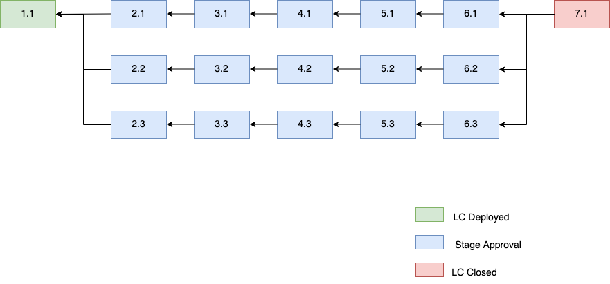
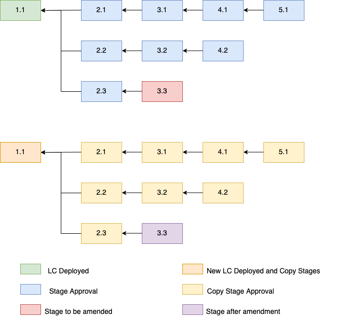
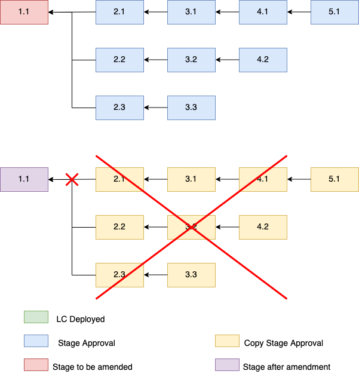
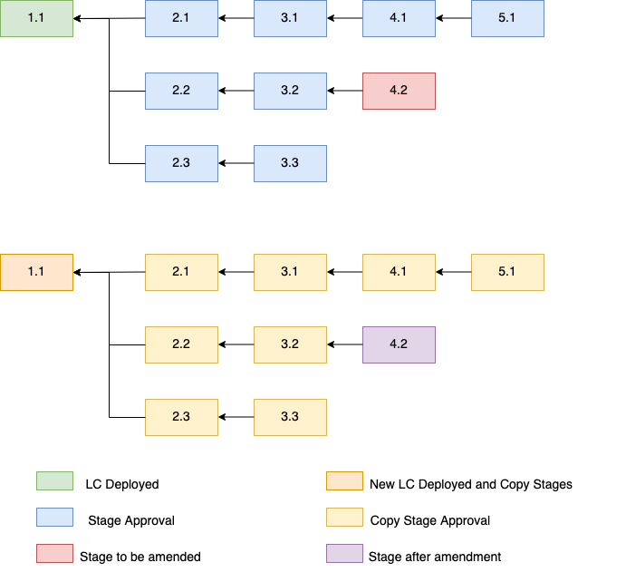
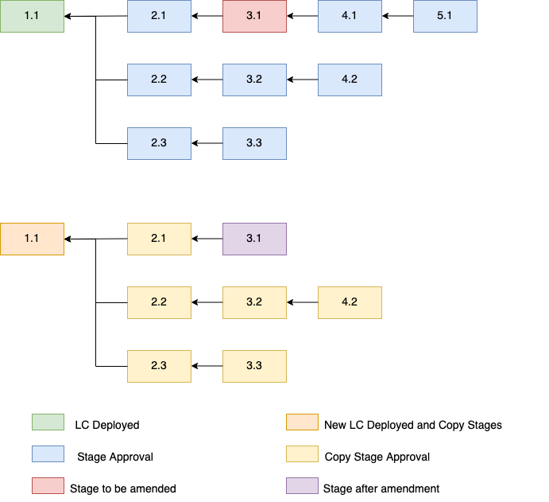

# Tu Chỉnh LC Contract - Amendment

  

Đối với blockchain thì vấn đề thay đổi nội dung trong một block sau khi được lưu on-chain là điều hoàn toàn không thể xảy ra. Ở design hiện tại những approval data cho các stages khác nhau khi đưa thông tin lên smart contract sẽ được liên kết với cách thức tương tự như các block liên kết với nhau. Tuy nhiên đối với smart contract, việc tu chỉnh (amendment) vẫn có thể thực hiện được với một số điều kiện ràng buộc. Trong phần này sẽ đề cấp đến những quy tắc trong việc tu chỉnh để có thể đảm bảo được những tính năng sau:
- Validity
- Integrity
- Fairness
- Transparency

#### Tu chỉnh sẽ deploy một LC Contract mới
Trong blockchain, những transactions bị failed đều được lưu lại nhằm đảm bảo tính transparency. Do đó, khi có việc tu chỉnh xảy ra thì việc đó cũng tương tự như một failed transaction và yêu cầu một LC Contract mới sẽ được deploy lại. Việc deploy lại một contract mới sẽ không bắt buộc các bên liên quan phải đưa lên on-chain lại từ đầu tất cả các stages. Mà thay vào đó sẽ cho phép được migrate những confirmed cũ sang LC Contract mới. Tuy nhiên, việc này sẽ có những quy tắc và sẽ được đề cập trong các phần tới

  

#### Tu chỉnh chỉ cho phép trên các sub-stages

- Thế nào là sub-stages? 
    - Đó là các Stage như 2.1, 2.2, 3.1, 3.2, .....
- Khi hợp đồng giữa Applicant và Beneficiary thay đổi
    - LC Contracts cần phải deploy lại
    - Các Stages cần phải được approve lại từ đầu vì trong trường hợp này `documentID` đã hoàn toàn là một thông tin mới
- Khi tu chỉnh Stage 1.1
    - LC Contracts cần phải deploy lại 
    - Các Stages cần phải được approve lại từ đầu vì thông tin của stages trước đó đã hoàn bị thay đổi 

  

- Cho phép tu chỉnh ở các sub-stages mới nhất của nhánh đó

  

- Cho phép tu chỉnh ở các sub-stages bất kỳ ở một nhánh với điều kiện là sau khi tu chỉnh thì nhánh sẽ có latest stage

  

#### Tu chỉnh cần chữ ký xác nhận của tất cả các bên
Trong trường hợp có tu chỉnh cần được thực hiện, các stages sẽ được migrate sang LC contract mới cần được ký metamask để xác nhận bởi các bên có liên quan trong hợp đồng LC Contract

- Mỗi Stage sẽ được lưu trên contract với một `stage_hash`
- Khi stages được đồng ý để migrate sang LC contract mới, các stages này sẽ được ký metamask để đồng ý migrate bởi các bên. Ví dụ:
    - Stage 1.1 (`stage_hash = 0x11`), Stage 2.1 (`stage_hash = 0x21`), Stage 2.2 (`stage_hash = 0x22`), Stage 3.1 (`stage_hash = 0x31`), và Stage 4.1 (`stage_hash = 0x41`)
    - Stage 4.1 cần được tu chỉnh và các Stages còn lại sẽ được migrate
    - `Applicant`, `Beneficiary`, `IssuingBank`, `AdvisingBank` cần ký vào thông tin `[0x11, 0x21, 0x22, 0x31]` để đồng ý và xác nhận việc migrate các stages trên sang LC contract mới
    - Khi các chữ ký được cung cấp đầy đủ và hợp lệ, thì sẽ tự động copy những thông tin của Stages bên LC contract cũ và đưa sang contract mới
    - Cuối cùng là trạng thái mới nhất của Stage 4.1 sẽ được đưa lên LC contract mới