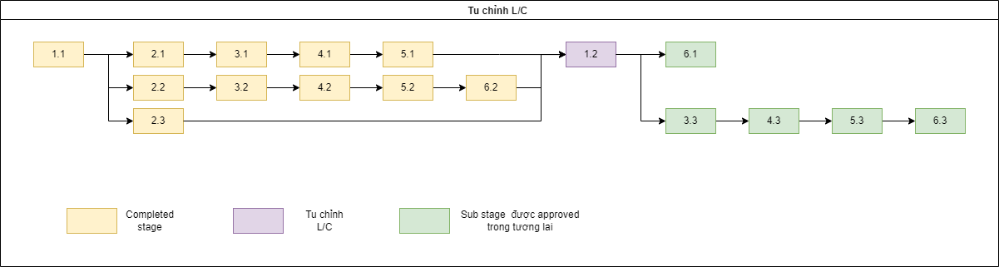

# Phản hồi tu chỉnh L/C

#### Tu chỉnh sẽ deploy một contract mới trong trường hợp thay đổi nội dung một bước đã hoàn thành trong luồng
- Subtages mới nhất 

  

- Subtages bất kì không phải mới nhất => subtage bị tu chỉnh sẽ trở thành substage mới nhất của luồng

  

Trường hợp tu chỉnh này sẽ **bắt buộc** phải có sự đồng ý của tất cả các bên tham gia (2 ngân hàng hoặc 3 ngân hàng, ko có beneficiary và applicant)

#### Tu chỉnh sẽ *KHÔNG* deploy một contract mới trong trường hợp thực hiện thay đổi bước 1.1 
 - Luồng sẽ "chụm lại" ở bước 1.2 và chạy tiếp những phần còn thiếu theo stage 1.2 đó
 
 

  

Trường hợp tu chỉnh này sẽ **không cần** có sự đồng ý của tất cả các bên tham gia (2 ngân hàng hoặc 3 ngân hàng)

??? Làm thế nào để ghi nhận là thay đổi về luồng cũ 
