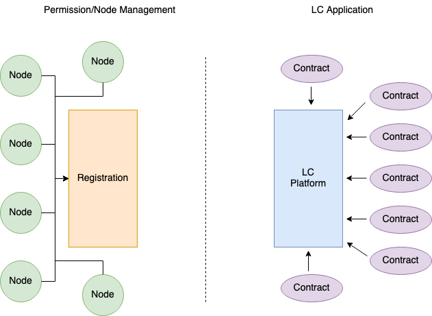
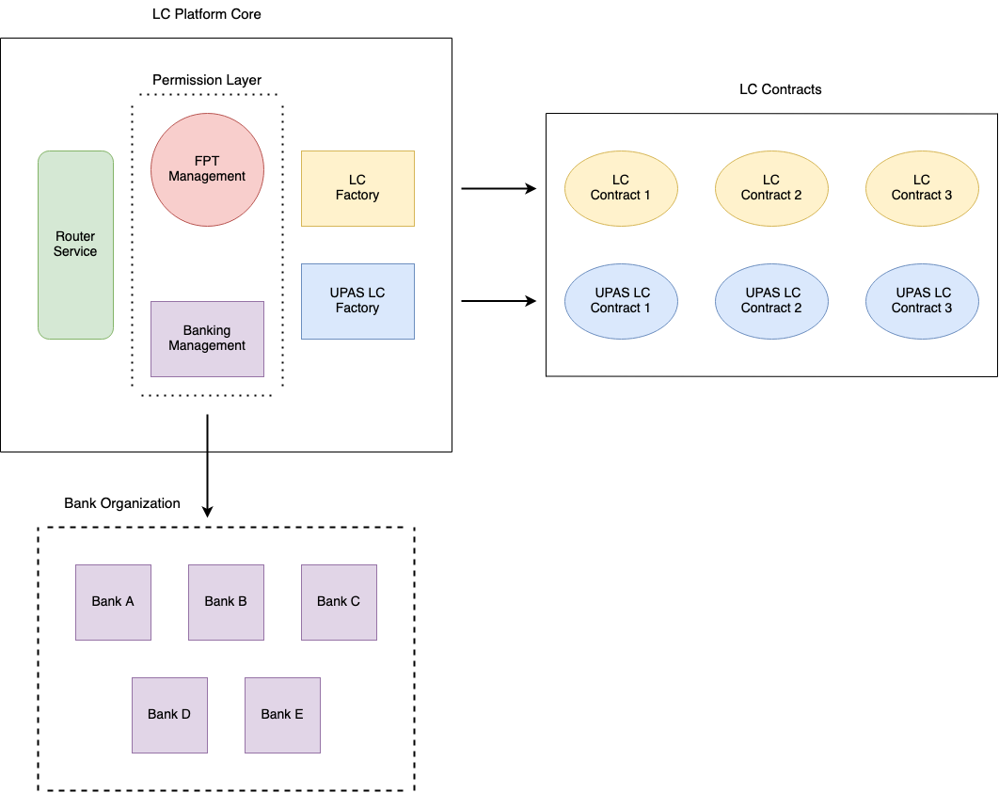

# LC Platform - Smart Contracts

  

Về mặt tổng quan, thì hệ thống các smart contract sẽ được chia thành 2 groups phục vụ cho những layer riêng biệt:
- Permission Layer sẽ có các smart contracts được cung cấp nhằm phục vụ cho việc Nodes/Accounts Service Management
- LC Application Layer sẽ có các smart contracts được tạo ra nhằm phục vụ cho các hợp đồng LC

- Theo dự định ban đầu, Permission Layer và LC Application Layer sẽ được tách riêng để dễ dàng cho việc scalability và cung cấp thêm những features khác mà không ảnh hưởng đến Permission Layer
  - Node Service: Fullnode/RPC client để sync-up data và gửi transaction request
    - Ví dụ: Ngân hàng A sẽ có Node Service A1, A2, A3; FPT Platform có Node Service F1, F2, F3, F4
  - Account Service: những account/address sẽ tương tác với LC Platform smart contracts
    - Ví dụ: Doanh Nghiệp D - Account Service D1 và Ngân hàng A - Account Service A1, A2, A3 (đồng thời là Node Service)
  - Doanh nghiệp/Ngân hàng hoàn toàn có thể có những Account Service mà không cần phải đăng ký Node Service
  - Smart contracts ở LC Application Layer hoàn toàn không bị phụ thuộc vào Genesis contracts ở Permission Layer

- Tuy nhiên, dựa theo cơ chế quản lý của Quorum thì tất cả các accounts/nodes đều cần được đăng ký và quản lý bởi Admin của hệ thống để có thể thực hiện những tác vụ trong hệ thống blockchain (event listener, send/receive txs, deploy contracts). Nếu dùng cách thiết kế như dự định ban đầu sẽ dẫn đến tình trạng duplicate settings/tasks không thật sự cần thiết. Do đó, ở thời điểm hiện tại có thể sử dụng Permission Layer cho việc quản lý nodes/accounts cho cả hai layers mà không cần tách riêng. Nếu như nhu cầu trong tương lai đòi hỏi những yêu cầu khác thì có thể cân nhắc việc thêm extension contracts 
    
## LC Platform

  

- LC Platform (smart contracts) được chia ra thành 2 modules chính:
    - LC Platform Core: cung cấp những chức năng như Quản lý (management) và Dịch vụ (Utils/Services). Module này bao gồm:
      - Permission Management: là các smart contracts kế thừa từ Quorum cho việc quản lý (management)
      - Service: i.e. `Router Service`, `LC Factory` và `UPAS LC Factory`
    - LC Contracts: 
      - Là hệ thống tập họp các hợp đồng giữa các bên liên quan Cá Nhân/Doanh Nghiệp - Cá Nhân/Doanh Nghiệp - Ngân hàng
      - Được tạo ra bởi `LC Factory` hoặc `UPAS LC Factory`

### LC Platform Core

- LC Platform Core bao gồm các contract sau:
  - Permission Management: quản lý toàn bộ tổ chức và special roles trong LC Platform (kế thừa từ Quorum)
    - Hiện tại sẽ có 3 loại tổ chức: NETWORK_ADMIN (FPT), BANKING và CORPORATION
      - NETWORK_ADMIN: giữ nhiệm vụ quản lý toàn bộ hệ thống 
        - Có quyền thêm hoặc loại bỏ tổ chức (organization)
        - Có quyền assign `ADMIN_ROLE` cho một tổ chức
        - Có quyền add thêm Node Service
        - Có quyền add/remove blacklist
      - BANKING: 
        - Là một loại tổ chức trong hệ thống
        - Được tạo ra bởi `NETWORK_ADMIN`
        - Mỗi Ngân hàng sẽ có một tổ chức của riêng mình để quản lý các account thuộc hệ thống của ngân hàng đó
        - Mỗi tổ chức ngân hàng sẽ được cho phép một hoặc nhiều `ADMIN_ROLE` để quản lý tổ chức
        - `ADMIN_ROLE` có quyền thêm `Sub Org` và special roles trong hệ thống tổ chức đang quản lý
      - CORPORATION:
        - Là một loại tổ chức trong hệ thống
        - Mỗi doanh nghiệp sẽ cần đăng ký ít nhất một account
        - `NETWORK_ADMIN` add thêm tổ chức và đồng thời assign role cho account
  - LC Factory:
    - Là contract phục vụ cho việc khởi tạo các hợp đồng nội địa `LC Contract`
  - UPAS LC Factory:
    - Là contract phục vụ cho việc khởi tạo các hợp đồng `UPAS LC Contract`
  - Router Service:
    - Cung cấp các methods để Ngân hàng, Cá nhân/Doanh nghiệp (được cấp role) có thể tương tác với các hợp đồng `LC Contract` hoặc `UPAS LC Contract`
- LC Contract / UPAS LC Contract:
  - Là các hợp đồng giao dịch giữa các bên liên quan Cá nhân/Doanh Nghiệp - Cá nhân/Doanh Nghiệp - Ngân hàng
  - Mỗi hợp đồng sẽ có các `stage` quy định khác nhau. Một hợp đồng sẽ có các điểm sau:
    - Nội dung của hợp đồng và các chứng từ liên quan sẽ được cung cấp giao thức để truy xuất
    - Nội dung sẽ được lưu off-chain nhưng tính chất consistent và unalterable sẽ được bảo đảm
    - Các bên tham gia đồng ý với các điều khoản, thông tin trong hợp đồng
    - Khi có bất kỳ thay đổi -> `LC Contract`/`UPAS LC Contract` cần phải deploy lại và các bên cần phải verify lại
    - Hợp đồng thành công và hoàn thành khi tất cả các `stage` trong hợp đồng được `approved`
    - Hợp đồng cần được hoàn thành đúng thời hạn (TBA)