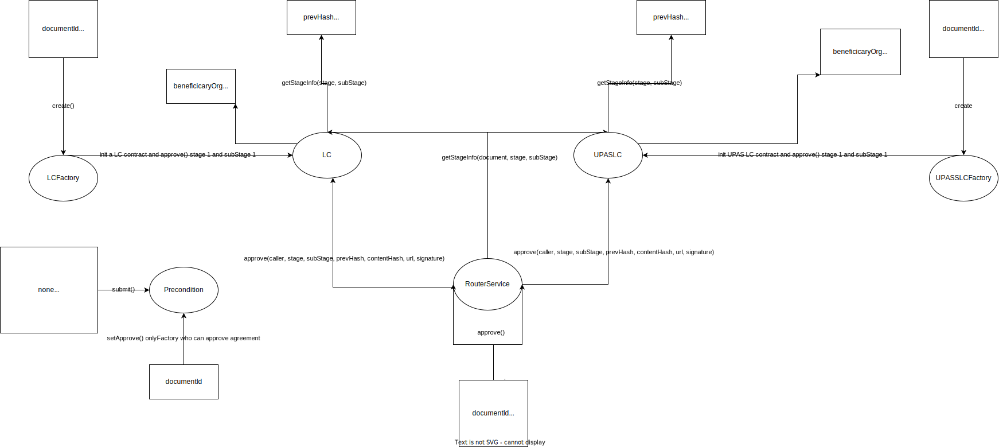

# LC smart contract flow



UML url: http://www.plantuml.com/plantuml/uml

> copy paragraphs to UML

1. create LC

- state diagram

```
@startuml
[*] --> Factory_Contracts
Factory_Contracts : documentId
Factory_Contracts : LC address
Factory_Contracts --> 1.1
1.1 : rootHash
1.1 : contentHash
1.1 --> [*]
@enduml
```

- sequence diagram

```
@startuml
Interface_or_Backend -> Middleware : gửi lên params và yêu cầu khởi tạo LC
Middleware -> AMC : gọi factory tương ứng để khởi tạo LC
AMC -> StandardFactory_or_UPASFactory : khởi tạo LC tương ứng từ params gửi lên
StandardFactory_or_UPASFactory -> StandardFactory_or_UPASFactory: check documentId đã sử dụng và caller là NHPH?
Middleware <-- StandardFactory_or_UPASFactory : return error nếu check false
Interface_or_Backend <-- Middleware : return error
StandardFactory_or_UPASFactory -> StandardLC_or_UPASLC : deploy LC contract tương ứng
StandardLC_or_UPASLC -> StandardLC_or_UPASLC : approve stage 1.1 (LC được phát hành)
StandardLC_or_UPASLC -> StandardLC_or_UPASLC : check signature và param gửi lên là do NHPH ký và gửi không?
StandardLC_or_UPASLC -> StandardLC_or_UPASLC : check acknowledge signature và acknowledge messages gửi lên là do managerOrg(FIS) ký không?
Middleware <-- StandardLC_or_UPASLC : return error nếu check false
Interface_or_Backend <-- Middleware : return error
Middleware <- StandardLC_or_UPASLC : return địa chỉ của LC contract vừa được khởi tạo
Interface_or_Backend <- Middleware : return detail transaction khởi tạo LC thành công
@enduml
```

2. approve LC

- state diagram

```
@startuml
[*] --> RouterService
RouterService : documentId
RouterService : stage
RouterService : subStage
RouterService : LC address
RouterService --> 1.1
1.1 : rootHash
1.1 : contentHash 1.1
1.1 --> 2.1
2.1 : rootHash
2.1 : contentHash 2.1
1.1 --> 2.2
2.2 : rootHash
2.2 : contentHash 2.2
2.1 --> 3.1
3.1 : rootHash
3.1 : contentHash 3.1
2.2 --> [*]
3.1 --> [*]
@enduml
```

- sequence diagram

```
@startuml
Interface_or_Backend -> Middleware : gửi lên params và yêu cầu cập nhật trạng thái LC
Middleware -> AMC : gọi router để cập nhật trạng thái LC
AMC -> Router : từ documentId lookup địa chỉ của LC contract tương ứng
Middleware <-- Router : return error "DocumentId not found" nếu không tìm thấy LC tương ứng
Interface_or_Backend <-- Middleware : return error
Router -> StandardLC_or_UPASLC : cập nhật trạng thái LC
StandardLC_or_UPASLC -> StandardLC_or_UPASLC : check signature và param gửi lên là do org có role trong stage được ký và gửi không?
StandardLC_or_UPASLC -> StandardLC_or_UPASLC : nếu stage là 1 or 4 or 5 check acknowledge signature và acknowledge messages gửi lên là do managerOrg(FIS) ký không?
Middleware <-- StandardLC_or_UPASLC : return error nếu check false
Interface_or_Backend <-- Middleware : return error
Middleware <- StandardLC_or_UPASLC : return detail transaction cập nhật trạng thái LC thành công
Interface_or_Backend <- Middleware : return detail transaction cập nhật trạng thái LC thành công
@enduml
```

3. getContent LC

- state diagram

```
@startuml
[*] --> RouterService
RouterService : documentId
RouterService : stage
RouterService : subStage
RouterService : LC address
RouterService --> 2.1
2.1 : rootHash
2.1 : contentHash 2.1
2.1 --> [*]
@enduml
```

- sequence diagram

```
@startuml
Interface_or_Backend -> Middleware : gửi lên params và yêu cầu tra cứu thông tin LC
Middleware -> AMC : gọi router để tra cứu thông tin LC
AMC -> Router : từ documentId lookup địa chỉ của LC contract tương ứng
Middleware <-- Router : return error "DocumentId not found" nếu không tìm thấy LC tương ứng
Interface_or_Backend <-- Middleware : return error
Router -> StandardLC_or_UPASLC : tra cứu thông tin LC
Middleware <- StandardLC_or_UPASLC : return detail content của stage cần tra cứu(rootHash, signedTime, prevHash, numOfDocuments, contentHash, url, acknowledge, signature)
Interface_or_Backend <- Middleware : return detail content của stage cần tra cứu
@enduml
```
